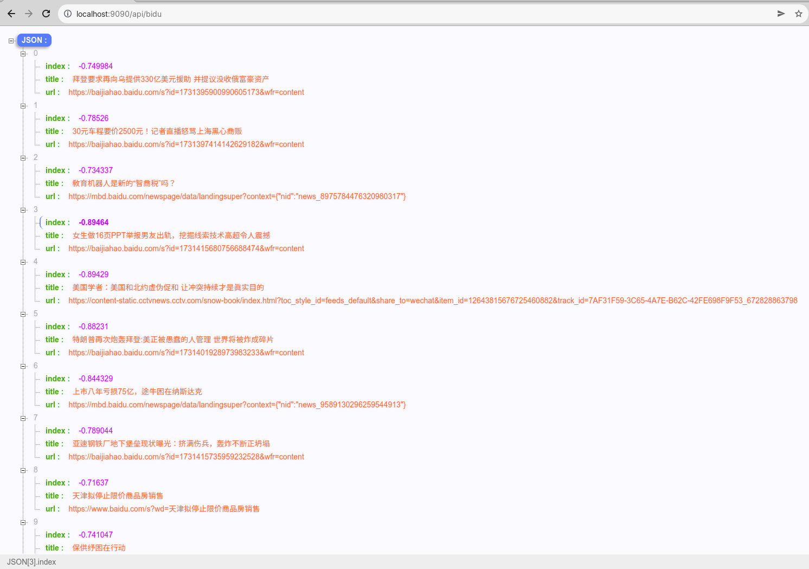

# README
### dependence
1. jdk1.8+
2. maven 3.8.5

### build
```shell
cd <project_root_dir>
mvn clean package
java -jar target/penny-practice-0.0.1-SNAPSHOT.jar
```

### api
> index(baobian) of bidu hot news
> 
```shell
curl http://localhost:9090/api/bidu
```

> as below
> 

